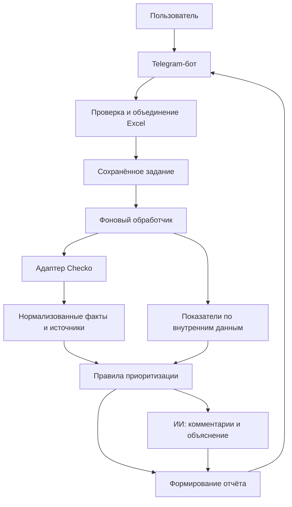

# Помощник претензионщика

Telegram-бот для первичной проверки должников и расстановки приоритетов в работе с дебиторской задолженностью. Пользователь загружает Excel, сервис объединяет данные о долгах, платежах и взаимодействиях с контрагентами со сведениями Checko и готовит объяснимый отчёт.

**Статус: проектирование MVP.** В репозитории созданы структура папок и документация. Бот, интеграции, расчёты и запуск пока не реализованы. Все описания поведения ниже — требования к первой версии.

## Задача продукта

Помочь претензионщику ответить на три вопроса:

1. Каких должников проверить в первую очередь?
2. Какие факты объясняют этот приоритет?
3. Что проверить или подготовить следующим шагом?

Результат — краткая сводка в Telegram и Excel-отчёт с приоритетами, причинами, источниками и полнотой проверки. Экономию времени и влияние на возврат денег предстоит измерить на пилоте; оценки из первоначальной идеи не считаются подтверждёнными метриками.

## Границы первой версии

Рабочие предположения: один пилотный заказчик, доступ по списку Telegram ID, личные чаты, российские юридические лица, расчёты в рублях. Начальный продуктовый лимит — 50 уникальных ИНН в одной проверке. Это выбранное ограничение MVP, а не лимит Telegram или Checko.

| Входит в MVP | После проверки MVP |
| --- | --- |
| Telegram-бот с загрузкой `.xlsx` по шаблону | Веб-кабинет и MAX-бот |
| Список организаций с ИНН; долги и просрочка при наличии | Прямое подключение к 1С |
| Дополнительные файлы платежей, взаимодействий и истории долга | Произвольные форматы выгрузок и автоматическое сопоставление колонок |
| Checko: сведения об организации, сообщения ЕФРСБ, финансовая отчётность | Другие поставщики, отдельный анализ ФССП и массовых исков |
| Правила приоритизации и объяснения причин | Обучаемая модель вероятности невозврата |
| ИИ-сводка комментариев и рекомендации по проверке | Подготовка процессуальных документов |
| Сводка и Excel-отчёт | Подписки, биллинг, командные роли, регулярный мониторинг |
| Деморежим с явно обозначенными синтетическими данными | Поддержка ИП и физических лиц |

Для самого первого рабочего этапа достаточно файла с ИНН и внешней проверки. Анализ платежей и комментариев добавляется следующим этапом в рамках того же MVP.

## Пользовательский сценарий

1. Пользователь начинает новую проверку и получает шаблон с описанием колонок.
2. Загружает список контрагентов, указывает дату анализа, при желании добавляет файлы платежей, взаимодействий и истории долга. Файлы связываются по ИНН внутри одной проверки.
3. Бот показывает число организаций, найденные ошибки и доступные виды анализа. Пользователь нажимает «Проверить» после загрузки всех нужных файлов.
4. Сервис сохраняет задание, проверяет уникальные ИНН через Checko и рассчитывает доступные показатели.
5. Правила назначают приоритет и сохраняют основания. ИИ формирует краткое объяснение с учётом комментариев.
6. Пользователь получает сводку и `.xlsx`: организации, суммы, приоритеты, причины, рекомендации и сведения о неполных проверках.

Если Checko или ИИ недоступны, сервис возвращает доступную часть результата с указанием пропусков. Ошибка источника не превращается в «рисков нет».

## Как формируется результат

**Приоритет и полнота проверки — отдельные показатели.** Подтверждённый серьёзный сигнал сохраняет высокий приоритет даже при недоступности другого источника. При отсутствии сигналов и неполной проверке вывод — «недостаточно данных», а не зелёная отметка.

| Приоритет | Значение в продукте |
| --- | --- |
| 🔴 Критичный | Есть подтверждённый сигнал для первоочередной проверки специалистом |
| 🟠 Высокий | Сработало правило существенного ухудшения либо сочетание сигналов |
| 🟡 Средний | Есть отдельные основания для внимания |
| 🟢 Низкий | В полном согласованном наборе проверок значимые сигналы не выявлены |
| ⚪ Недостаточно данных | Данных недостаточно для вывода и нет основания для более высокого приоритета |

Цвет обозначает рабочий приоритет, а не вероятность банкротства. Каждая причина содержит значение показателя, дату и ссылку на источник либо строку входного файла.

### Роль ИИ

- Выделить из комментариев обещания оплаты, возражения и договорённости, указав исходную запись.
- Объяснить рассчитанные показатели и найденные события простым языком.
- Предложить специалисту следующий шаг на основании переданных фактов.

Суммы, просрочку, динамику выручки и уровень приоритета рассчитывает код. ИИ получает ограниченный набор фактов и возвращает ответ по схеме; он не меняет скоринг и не обращается к внешним системам самостоятельно. При ошибке ИИ отчёт строится по шаблону.

Рекомендации предназначены для проверки специалистом. Продукт не определяет процессуальные сроки и не делает вывод о необходимости включения в реестр только по наличию сообщения о банкротстве.

## Архитектура

Один репозиторий и одно приложение с разделением обязанностей по модулям. Обработчики Telegram вызывают прикладные сценарии; правила анализа не зависят от мессенджера и поставщика данных.



### Предлагаемый стек

| Часть | Выбор для MVP |
| --- | --- |
| Язык | Python |
| Telegram | aiogram |
| Таблицы | openpyxl |
| Валидация данных | Pydantic |
| HTTP-интеграции | httpx |
| Хранилище | SQLite, SQLAlchemy и миграции Alembic |
| Фоновые задания | Один обработчик, очередь заданий в БД |
| ИИ | Адаптер выбранного провайдера с проверкой структурированного ответа |
| Проверки реализации | pytest; отдельные сценарии оценки ИИ |

Версии библиотек будут закреплены при создании запускаемого каркаса. Redis, отдельный HTTP API и микросервисы на первом этапе не требуются. Для нескольких экземпляров приложения планируется переход на PostgreSQL и отдельную очередь; выбор СУБД не должен менять правила анализа.

## Структура репозитория

```text
.
├── README.md
├── AGENTS.md                   # Правила рабочей области
├── docs/
│   ├── architecture.md         # Границы модулей, задания, данные и ИИ
│   ├── data-contracts.md       # Форматы Excel и выходного отчёта
│   ├── scoring.md              # Проект правил и обработка неизвестности
│   ├── integrations.md         # Checko и контракт адаптера
│   └── roadmap.md              # Этапы и критерии готовности
├── src/claims_assistant/
│   ├── README.md               # Правила размещения будущего кода
│   ├── presentation/telegram/  # Команды, загрузки, кнопки, выдача отчёта
│   ├── application/            # Сценарии и интерфейсы зависимостей
│   ├── domain/                 # Сущности, показатели, правила приоритета
│   ├── infrastructure/
│   │   ├── checko/             # HTTP-клиент и нормализация Checko
│   │   ├── llm/                # Провайдер ИИ и валидация ответа
│   │   ├── excel/              # Чтение шаблонов и экспорт отчётов
│   │   └── persistence/        # БД, репозитории, файловое хранилище
│   └── runtime/                # Настройки, сборка приложения, обработчик заданий
├── prompts/                    # Версионируемые инструкции ИИ
├── migrations/                 # Будущие миграции БД
├── tests/
│   ├── unit/                   # Показатели, правила, нормализация
│   ├── integration/            # Файлы, БД, контракты интеграций
│   └── acceptance/             # Полный пользовательский сценарий
├── evals/                      # Проверка качества ответов ИИ
├── examples/                   # Будущие шаблоны и синтетические примеры
└── sources/                    # Синхронизированные материалы, только чтение
```

Пустые каталоги сохранены через `.gitkeep`. Рабочие базы, загруженные файлы, ключи и реальные данные клиентов в репозиторий не добавляются.

## Документация

- [Архитектура и ответственность модулей](docs/architecture.md).
- [Входные данные и отчёт](docs/data-contracts.md).
- [Правила приоритизации](docs/scoring.md).
- [Интеграции и подтверждённые возможности Checko](docs/integrations.md).
- [План реализации и критерии приёмки](docs/roadmap.md).

## Запуск и следующий этап

Команд запуска пока нет: это архитектурный каркас, а не работающее приложение. Следующий этап — добавить зависимости и настройки, подготовить синтетический `.xlsx`, реализовать загрузку ИНН и отчёт на демоданных. Затем подключить реальный Checko и проверить контракт на доступном ключе.

Перед подключением реальных данных понадобятся обезличенные примеры выгрузок, доступ к нужным методам Checko и выбор допустимого провайдера ИИ. Сроки и стоимость разработки оцениваются после проверки этих входных условий; подписки и внешние API учитываются отдельно.
