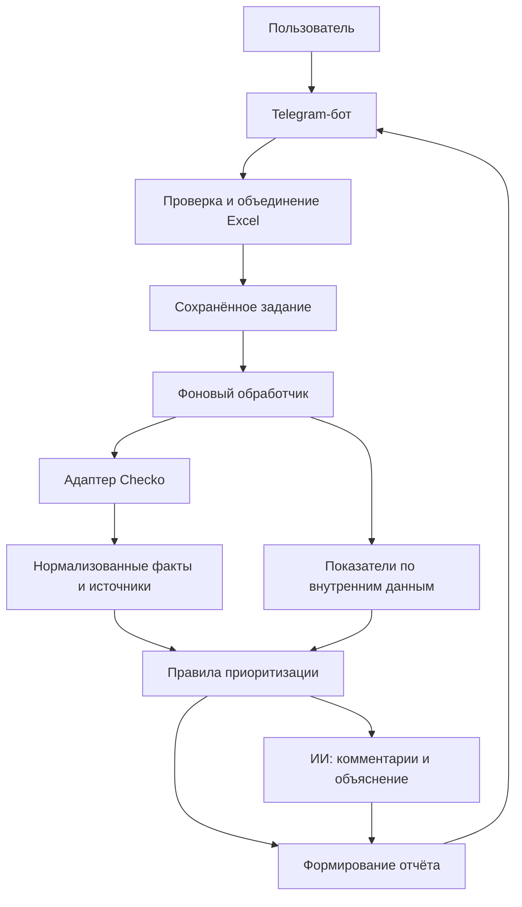

# Помощник претензионщика

Telegram-бот для первичной проверки должников и расстановки приоритетов в работе с дебиторской задолженностью. В целевом MVP пользователь загружает Excel, сервис объединяет данные о долгах, платежах и взаимодействиях с контрагентами со сведениями Checko и готовит объяснимый отчёт.

**Статус: реализована оболочка Telegram-бота.** Работают команды, меню, доступ по списку Telegram ID, локальный запуск, ввод ИНН с проверкой контрольной цифры, карточка контрагента на синтетических демоданных, загрузка списка «Контрагенты» из `.xlsx` с сохранением проверки в SQLite и один фоновый обработчик очереди (пока только перечитывает пакет и фиксирует итог). Первый адаптер Checko получает название и ограниченный статус организации; ЕФРСБ, финансы, расчёты и отчёты ещё не подключены. Разделы про анализ данных ниже описывают целевой MVP.

**Рабочая память проекта — [PROJECT_STATUS.md](PROJECT_STATUS.md).** Перед каждой задачей читать этот файл; после важных изменений обновлять статус, проверки и выводы из ошибок. Перед завершением задачи сверять журнал с фактическим результатом. Если нового результата или решения нет, запись не нужна.

Ветка S1-05 добавляет реальный режим Checko: [настройка, границы проверки и ошибки](docs/checko-company.md). По умолчанию остаётся деморежим.

## Что работает сейчас

- `/start` — приветствие и главное меню.
- `/help` и кнопка «Помощь» — справка.
- `/about` и кнопка «О сервисе» — назначение проекта и текущий статус.
- `/inn` и кнопка «Проверить ИНН» — ввод ИНН юридического лица. Ошибочный ИНН получает объяснение без повторения введённого текста; «Отмена» или `/cancel` возвращают меню; по корректному ИНН показывается карточка: организация, сообщения о банкротстве и финансы с датами, источниками, полнотой и ограничениями. В режиме `demo` данные синтетические, карточка помечена «ДЕМО», сценарий выбирается настройкой `DEMO_SCENARIO`. В режиме `checko` показываются реальные сведения организации с ограничениями; ЕФРСБ и финансы помечаются как непроверенные. Оценки приоритета пока нет.
- `/check` и кнопка «Новая проверка» — дата анализа («Сегодня» или ДД.ММ.ГГГГ) → бот присылает шаблон → файл `.xlsx` с листом «Контрагенты» (до 10 МБ, проверяется до скачивания) → сводка: число организаций и ошибки строк с координатами (без содержимого ячеек) → на шаге подтверждения можно добавить необязательные файлы (S4-01): «Добавить платежи» — сначала период, за который выгрузка полная (ДД.ММ.ГГГГ–ДД.ММ.ГГГГ, конец не позже даты анализа; указание периода — подтверждение полноты), затем шаблон и файл с листом «Платежи»; «Добавить историю долга» — шаблон и файл с листом «История долга»; «Добавить взаимодействия» (S4-02) — шаблон и файл с листом «Взаимодействия» (ИНН, ID, дата, комментарий, необязательный канал; хронология по ИНН, тексты комментариев в чат не возвращаются). Строки с ИНН вне файла «Контрагенты» отбрасываются с ошибкой, файл без пригодных строк не сохраняется, повтор того же файла не дублируется; после каждого файла бот показывает состав пакета (файл, строки, период). «Отмена» внутри добавления файла возвращает к пакету, «Отмена» на подтверждении отменяет проверку. Второй, отличающийся файл «Контрагенты» в тот же пакет не принимается (объяснение — начать новую проверку). Перед запуском пакет проверяется целиком (S4-03): каждый файл принадлежит этой проверке, файл «Контрагенты» один, ID платежей/взаимодействий и срезы долга не повторяются между файлами (повтор с теми же данными — предупреждение, с другими — ошибка), срез долга на дату анализа совпадает с «Контрагентами», дата последнего платежа согласуется с выгрузкой за подтверждённый период; сквозные замечания показываются один раз при запуске и попадают на лист «Качество данных» отчёта, а пакет с двумя основными файлами не запускается. → «Запустить проверку» ставит проверку в очередь; фоновый обработчик в том же процессе берёт проверки по одной, не блокируя ответы бота, и выполняет конвейер S3-01: импорт → внешние данные по каждому ИНН через общий guard (бюджет времени и запросов на всю проверку, повторы, кэш) → правила приоритета (`docs/scoring.md`) → Excel-отчёт на четырёх листах. По завершении бот присылает сводку (статус, число организаций, распределение приоритетов, без ИНН и сумм) и файл отчёта; итог — `completed` / `partial` (ошибки строк, недоступные разделы источника, исчерпанный лимит — полезная часть отчёта сохраняется) / `failed` (нет файла, нет пригодных строк, отчёт не записался). Режим demo/live задаётся настройкой сервиса явно: проверка другого режима не выполняется, отказ источника остаётся отказом в отчёте и не подменяется демоданными. Прерванные перезапуском проверки возвращаются в очередь при старте, после трёх прерываний — останавливаются. Повтор того же файла в пакете не дублируется. Файл без пригодных строк не создаёт проверку.
- `/status` и кнопка «Статус» — состояние последней проверки владельца; если отчёт уже построен, статус подсказывает `/report`.
- `/report` и кнопка «Отчёт» — повторная выдача новейшего готового отчёта владельца из хранилища без нового анализа (черновик или очередь новой проверки его не прячут; в подписи к файлу — дата анализа); доставка фиксируется отдельно от статуса проверки, сбой отправки Telegram просит повторить команду. Пока отчёт строит только конвейер S3-01, до него команда отвечает «готового отчёта нет».
- Неизвестные команды и сообщения получают подсказку. Вложения получают ответ о том, что загрузка пока не поддерживается; содержимое файлов не скачивается и не сохраняется приложением.
- Только личные чаты и пользователи из списка доступа. Остальным бот сообщает их Telegram ID для передачи разработчику. В группах бот не отвечает.

Инструкция установки и запуска находится в [конце README](#локальный-запуск). Для подключения второго разработчика есть [чеклист спринта 0](docs/sprint-0.md).

## Задача продукта

Помочь претензионщику ответить на три вопроса:

1. Каких должников проверить в первую очередь?
2. Какие факты объясняют этот приоритет?
3. Что проверить или подготовить следующим шагом?

Результат — краткая сводка в Telegram и Excel-отчёт с приоритетами, причинами, источниками и полнотой проверки. Экономию времени и влияние на возврат денег предстоит измерить на пилоте; оценки из первоначальной идеи не считаются подтверждёнными метриками.

## Границы первой версии

Рабочие предположения: один пилотный заказчик, доступ по списку Telegram ID, личные чаты, российские юридические лица, расчёты в рублях. Начальный продуктовый лимит — 50 уникальных ИНН в одной проверке. Это выбранное ограничение MVP, а не лимит Telegram или Checko.

| Входит в MVP | После проверки MVP |
| --- | --- |
| Telegram-бот с загрузкой `.xlsx` по шаблону | Веб-кабинет и MAX-бот |
| Список организаций с ИНН; долги и просрочка при наличии | Прямое подключение к 1С |
| Дополнительные файлы платежей, взаимодействий и истории долга | Произвольные форматы выгрузок и автоматическое сопоставление колонок |
| Checko: сведения об организации, сообщения ЕФРСБ, финансовая отчётность | Другие поставщики, отдельный анализ ФССП и массовых исков |
| Правила приоритизации и объяснения причин | Обучаемая модель вероятности невозврата |
| ИИ-сводка комментариев и рекомендации по проверке | Подготовка процессуальных документов |
| Сводка и Excel-отчёт | Подписки, биллинг, командные роли, регулярный мониторинг |
| Деморежим с явно обозначенными синтетическими данными | Поддержка ИП и физических лиц |

В roadmap для двух разработчиков первый предлагаемый функциональный шаг — ввод одного ИНН и карточка; затем загрузка списка из Excel. Анализ платежей и комментариев добавляется следующими этапами в рамках того же MVP.

## Пользовательский сценарий

1. Пользователь начинает новую проверку и получает шаблон с описанием колонок.
2. Загружает список контрагентов, указывает дату анализа, при желании добавляет файлы платежей, взаимодействий и истории долга. Файлы связываются по ИНН внутри одной проверки.
3. Бот показывает число организаций, найденные ошибки и доступные виды анализа. Пользователь нажимает «Проверить» после загрузки всех нужных файлов.
4. Сервис сохраняет задание, проверяет уникальные ИНН через Checko и рассчитывает доступные показатели.
5. Правила назначают приоритет и сохраняют основания. ИИ формирует краткое объяснение с учётом комментариев.
6. Пользователь получает сводку и `.xlsx`: организации, суммы, приоритеты, причины, рекомендации и сведения о неполных проверках.

Если Checko или ИИ недоступны, сервис возвращает доступную часть результата с указанием пропусков. Ошибка источника не превращается в «рисков нет».

## Как формируется результат

**Приоритет и полнота проверки — отдельные показатели.** Подтверждённый серьёзный сигнал сохраняет высокий приоритет даже при недоступности другого источника. При отсутствии сигналов и неполной проверке вывод — «недостаточно данных», а не зелёная отметка.

| Приоритет | Значение в продукте |
| --- | --- |
| 🔴 Критичный | Есть подтверждённый сигнал для первоочередной проверки специалистом |
| 🟠 Высокий | Сработало правило существенного ухудшения либо сочетание сигналов |
| 🟡 Средний | Есть отдельные основания для внимания |
| 🟢 Низкий | В полном согласованном наборе проверок значимые сигналы не выявлены |
| ⚪ Недостаточно данных | Данных недостаточно для вывода и нет основания для более высокого приоритета |

Цвет обозначает рабочий приоритет, а не вероятность банкротства. Каждая причина содержит значение показателя, дату и ссылку на источник либо строку входного файла.

### Роль ИИ

- Выделить из комментариев обещания оплаты, возражения и договорённости, указав исходную запись.
- Объяснить рассчитанные показатели и найденные события простым языком.
- Предложить специалисту следующий шаг на основании переданных фактов.

Суммы, просрочку, динамику выручки и уровень приоритета рассчитывает код. ИИ получает ограниченный набор фактов и возвращает ответ по схеме; он не меняет скоринг и не обращается к внешним системам самостоятельно. При ошибке ИИ отчёт строится по шаблону.

Рекомендации предназначены для проверки специалистом. Продукт не определяет процессуальные сроки и не делает вывод о необходимости включения в реестр только по наличию сообщения о банкротстве.

## Архитектура

Один репозиторий и одно приложение с разделением обязанностей по модулям. Обработчики Telegram вызывают прикладные сценарии; правила анализа не зависят от мессенджера и поставщика данных.



### Предлагаемый стек

| Часть | Выбор для MVP |
| --- | --- |
| Язык | Python |
| Telegram | aiogram |
| Таблицы | openpyxl |
| Валидация данных | Pydantic |
| HTTP-интеграции | httpx |
| Хранилище | SQLite, SQLAlchemy и миграции Alembic |
| Фоновые задания | Один обработчик, очередь заданий в БД |
| ИИ | Адаптер выбранного провайдера с проверкой структурированного ответа |
| Проверки реализации | pytest; отдельные сценарии оценки ИИ |

Зависимости работающей оболочки закреплены в `requirements.txt`, инструменты разработки — в `requirements-dev.txt`. Остальной стек таблицы относится к будущим этапам. Redis, отдельный HTTP API и микросервисы на первом этапе не требуются. Для нескольких экземпляров приложения планируется переход на PostgreSQL и отдельную очередь; выбор СУБД не должен менять правила анализа.

## Структура репозитория

```text
.
├── README.md
├── pyproject.toml              # Устанавливаемый пакет и настройки проверок
├── requirements.txt            # Закреплённые зависимости приложения
├── requirements-dev.txt        # Закреплённые инструменты тестирования и сборки
├── .env.example                # Шаблон настроек без ключей
├── AGENTS.md                   # Локальные правила рабочей области; не в Git
├── docs/
│   ├── architecture.md         # Границы модулей, задания, данные и ИИ
│   ├── data-contracts.md       # Форматы Excel и выходного отчёта
│   ├── scoring.md              # Проект правил и обработка неизвестности
│   ├── integrations.md         # Checko и контракт адаптера
│   └── roadmap.md              # Этапы и критерии готовности
├── src/claims_assistant/
│   ├── README.md               # Правила размещения кода
│   ├── __main__.py             # Запуск python -m claims_assistant
│   ├── presentation/telegram/  # Команды, кнопки, тексты и проверка доступа
│   ├── application/            # Сценарии и интерфейсы зависимостей
│   ├── domain/                 # Сущности, показатели, правила приоритета
│   ├── infrastructure/
│   │   ├── checko/             # HTTP-клиент и нормализация Checko
│   │   ├── llm/                # Провайдер ИИ и валидация ответа
│   │   ├── excel/              # Чтение шаблонов и экспорт отчётов
│   │   └── persistence/        # SQLite-репозиторий, схема и миграции Alembic (migrations/)
│   └── runtime/                # Настройки, сборка, polling и остановка
├── prompts/                    # Версионируемые инструкции ИИ
├── alembic.ini                 # CLI Alembic для новых миграций; приложение мигрирует само при старте
├── tests/
│   ├── unit/                   # Показатели, правила, нормализация
│   ├── integration/            # Файлы, БД, контракты интеграций
│   └── acceptance/             # Полный пользовательский сценарий
├── evals/                      # Проверка качества ответов ИИ
├── examples/                   # Будущие шаблоны и синтетические примеры
└── sources/                    # Синхронизированные материалы, только чтение
```

Пустые каталоги сохранены через `.gitkeep`. Рабочие базы, загруженные файлы, ключи и реальные данные клиентов в репозиторий не добавляются.

## Документация

В ветке S1-04 подготовлены типы фактов и демопровайдер для следующего сценария проверки ИНН. В Telegram он пока не подключён; требуется ревью общих типов.

- [Спринт 0: выполненное, открытые пункты и подключение коллеги](docs/sprint-0.md).
- [Архитектура и ответственность модулей](docs/architecture.md).
- [Входные данные и отчёт](docs/data-contracts.md).
- [Правила приоритизации](docs/scoring.md).
- [Интеграции и подтверждённые возможности Checko](docs/integrations.md).
- [Roadmap для двух разработчиков: спринты, задачи, оценки и критерии приёмки](docs/roadmap.md).
- [Контракт провайдера и запуск демосценариев S1-04](docs/company-data-provider.md).
- [Контракт хранения проверки S2-01: типы, интерфейс репозитория, что согласовать](docs/analysis-storage.md).
- [Доска YouGile: подключение, исполнители и правила ведения задач](docs/yougile.md).

## Локальный запуск

Требуется Python 3.12 или новее; 16.09.2026 установка по инструкции и 49 автоматических тестов проверены в отдельном чистом окружении на Python 3.14.4. [CI прошёл](https://github.com/Sopkas/artemProd/actions/runs/34993303811) на Ubuntu с Python 3.12 и 3.14. Команды ниже выполняются из корня репозитория в macOS/Linux.

### 1. Установка

```bash
python3 -m venv .venv
source .venv/bin/activate
python -m pip install -r requirements-dev.txt
python -m pip install --no-build-isolation --no-deps -e .
cp .env.example .env
```

Для Windows PowerShell (без активации окружения):

```powershell
py -3.13 -m venv .venv
.\.venv\Scripts\python.exe -m pip install -r requirements-dev.txt
.\.venv\Scripts\python.exe -m pip install --no-build-isolation --no-deps -e .
Copy-Item .env.example .env
# После заполнения .env:
.\.venv\Scripts\python.exe -m claims_assistant
```

Для проверок на Windows используйте `.\.venv\Scripts\python.exe -m pytest -q`, `.\.venv\Scripts\python.exe -m ruff check src tests`, `.\.venv\Scripts\python.exe -m ruff format --check src tests` и `.\.venv\Scripts\python.exe -m pip check`. Python 3.13 выбран по подтверждённой установке коллеги; в CI добавлена проверка Windows на этой версии. При повторной установке существующий `.env` сохраняйте.

Набор разработки включает зависимости приложения и закреплённые инструменты сборки. Для обновления зависимостей нужно согласованно обновлять оба файла требований и повторять проверки.

### 2. Настройки

Создайте бота через `@BotFather` в Telegram и внесите выданный токен в локальный `.env`. Этот файл исключён из Git. Для запуска нужен хотя бы один разрешённый ID.

| Переменная | Значение |
| --- | --- |
| `TELEGRAM_BOT_TOKEN` | Токен бота, обязательный |
| `ALLOWED_TELEGRAM_IDS` | Положительные числовые ID через запятую, например `123456789,987654321` |
| `LOG_LEVEL` | `DEBUG`, `INFO`, `WARNING`, `ERROR` или `CRITICAL`; по умолчанию `INFO` |
| `DEMO_SCENARIO` | Ответ демопровайдера для карточки: `ordinary` (по умолчанию), `alarm`, `incomplete`, `error`. Сценарий задаётся настройкой, а не ИНН |
| `EXTERNAL_TIMEOUT_SECONDS`, `EXTERNAL_MAX_RETRIES` | Таймаут одного внешнего запроса (20) и число повторов временных ошибок (2): таймаут, сетевая ошибка, HTTP-ошибка, лимит запросов; пауза 1, 2, 4 с или `Retry-After` источника. Постоянные ошибки (доступ, формат, не найдено) не повторяются |
| `EXTERNAL_CACHE_TTL_SECONDS` | Кэш успешных разделов по ИНН и разделу в памяти процесса (3600); закэшированный снимок сохраняет свою дату получения, и карточка её показывает. `0` отключает кэш |
| `RUN_TIME_LIMIT_SECONDS`, `RUN_REQUEST_LIMIT` | Общий бюджет одной проверки (900 с, 1 500 запросов); при исчерпании оставшиеся разделы помечаются недоступными с причиной, проверка завершается частично. Значения — стартовые из архитектуры, согласовать с тарифом Checko |
| `BUSINESS_UTC_OFFSET_HOURS` | Смещение делового часового пояса от UTC для кнопки «Сегодня» (3 — Москва по умолчанию, 10 — Владивосток); иначе после полуночи по местному времени «Сегодня» дало бы вчерашнюю дату по UTC |
| `STORAGE_PATH` | Каталог загруженных `.xlsx` (по умолчанию `data/uploads`, вне Git); файлы лежат как `<run_id>/<uuid>.xlsx`, путь проверяется после разрешения символических ссылок |
| `DATABASE_PATH` | Файл SQLite с проверками и загруженными файлами; по умолчанию `data/claims.sqlite3` (каталог создаётся, `data/` вне Git). Миграции применяются при запуске |

Если свой ID неизвестен, временно укажите `1` в списке доступа, запустите бота и отправьте ему `/start`. В ответе об ограничении доступа будет ваш ID. Замените временное значение на свой ID и перезапустите приложение.

Настройки окружения имеют приоритет над `.env`, в том числе пустые значения. Читается `.env` только из текущего каталога. Изменение списка доступа применяется после перезапуска. При отсутствии или неверном формате обязательных настроек приложение завершается до подключения к Telegram и объясняет причину.

### 3. Запуск и остановка

```bash
python -m claims_assistant
```

Бот получает сообщения через long polling, поэтому публичный адрес и сервер не требуются. Оставьте терминал открытым. Остановка — `Ctrl+C`; соединение с Telegram закрывается при завершении. Для одного токена запускайте один экземпляр приложения.

Если для токена уже настроен webhook, приложение сообщит об этом и остановится. Оно не удаляет существующее подключение автоматически. Неверный токен или недоступность Telegram при старте также приводят к понятной ошибке.

Журнал в терминале содержит события запуска, остановки и коды ошибок без содержимого переписки и токена. Необработанная ошибка отдельного сообщения перехватывается; следующие сообщения продолжают обрабатываться.

### 4. Проверки

```bash
python -m pytest -q
ruff check src tests
ruff format --check src tests
python -m pip check
```

Автоматические проверки используют подменённый Telegram API и синтетический токен: реальный ключ и сетевые запросы не требуются. Они проверяют команды, кнопки, доступ, вложения, настройки и восстановление после ошибки обработчика.

**На 16.09.2026:** токен владельца проверен через Telegram API, локальный бот запущен, команды зарегистрированы. Владелец подтвердил `/start`, `/help`, `/about`, обе кнопки, произвольный текст и файл; остановка SIGINT и повторный запуск проверены агентом. Коллега подтвердил установку на Windows, неизвестную команду и файл с подписью `/start`. Отказ постороннему пользователю также подтверждён коллегой. Остался групповой чат — см. [чеклист](docs/sprint-0.md).

## Следующий этап

Предлагаемый порядок для команды описан в [roadmap](docs/roadmap.md): общая рабочая версия → ввод одного ИНН и демокарточка → Excel и отчёт → реальный Checko → внутренние показатели → ИИ → выпуск. Подготовка адаптера Checko начинается параллельно с первым функциональным сценарием. Текущая оболочка не запрашивает и не хранит финансовые данные.

Перед подключением реальных данных понадобятся обезличенные примеры выгрузок, доступ к нужным методам Checko и выбор допустимого провайдера ИИ. Сроки и стоимость разработки оцениваются после проверки этих входных условий; подписки и внешние API учитываются отдельно.
